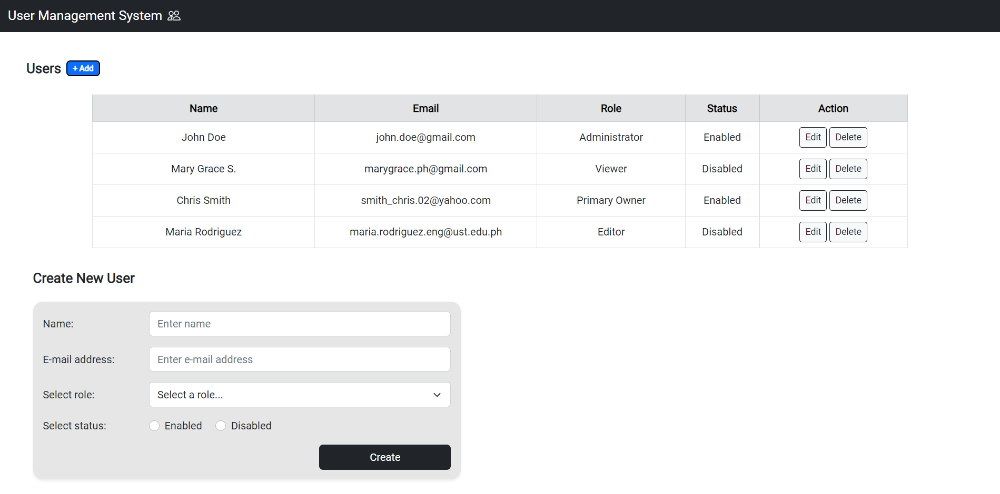
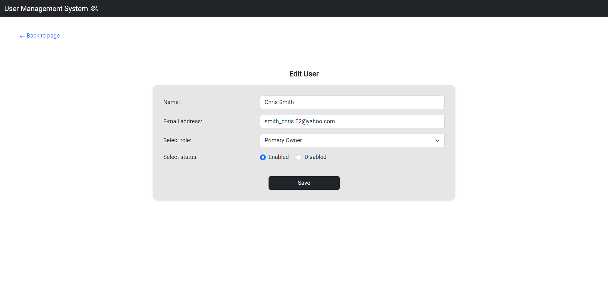

# User Management System

This is a User Management System app utilizing CRUD operations. The app was built using MongoDB, Express and Node.js. Bootstrap was also used for styling the app's contents.

## User features
 - Display all users in a single table
 - Add a user by clicking `+ Add` button
 - Update a user by clicking the designated `Edit` button
 - Remove a user clicking the designated `Delete` button

## Demo

[Check out the live demo on Heroku](https://desolate-river-13878.herokuapp.com/).